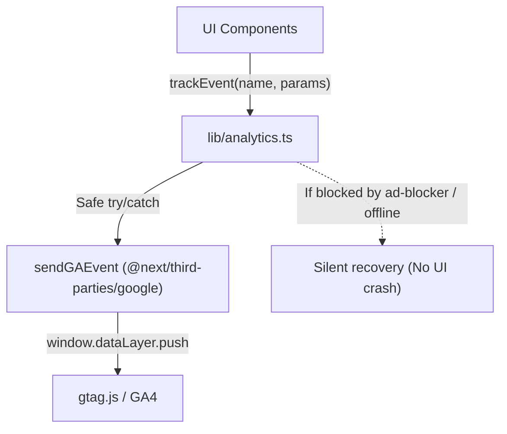

# Google Analytics 4 & Custom Event Tracking

## Overview

The portfolio integrates Google Analytics 4 via Next.js's official package: **`@next/third-parties/google`** (`<GoogleAnalytics gaId={process.env.NEXT_PUBLIC_GA_ID} />` with `NEXT_PUBLIC_GA_ID=G-8LVL1N08S6`).

In addition to standard page views and UTM campaign attribution, it instruments granular custom event tracking through a safe client utility: [`lib/analytics.ts`](../../lib/analytics.ts).

---

## Architecture & Ad-Blocker Resilience

---

## Event Catalog

| Event Name            | Parameters                                                 | Component                    | Purpose                                                     |
| --------------------- | ---------------------------------------------------------- | ---------------------------- | ----------------------------------------------------------- |
| `resume_click`        | `{ location: "hero" \| "footer" }`                         | `Hero.tsx`, `Footer.tsx`     | Measures recruiter CV downloads & conversion position       |
| `project_click`       | `{ project_name: string, url: string, location?: string }` | `Projects.tsx`, `Footer.tsx` | Identifies which specific GitHub projects generate interest |
| `social_click`        | `{ platform: "github" \| "linkedin", location: string }`   | `Hero.tsx`, `Footer.tsx`     | Tracks professional profile navigation                      |
| `email_click`         | `{ location: "hero" \| "footer" \| "footer_text" }`        | `Hero.tsx`, `Footer.tsx`     | Measures direct email intent                                |
| `contact_form_submit` | `{ status: "success" \| "error" \| "network_error" }`      | `ContactForm.tsx`            | Measures contact form completion rate                       |
| `theme_toggle`        | `{ new_theme: "light" \| "dark" }`                         | `ThemeToggle.tsx`            | Tracks visitor color theme preferences                      |
| `protocol_click`      | `{ target: "llms.txt" \| "sitemap" }`                      | `Footer.tsx`                 | Tracks discovery of machine-readable endpoints              |

---

## How to View in GA4 Dashboard

1. **Realtime Overview**:
   - Navigate to **Google Analytics &rarr; Reports &rarr; Realtime &rarr; Event count by Event name**.
   - Trigger any action (e.g. clicking Resume or toggling Theme) to see the event appear live within seconds.

2. **Custom Exploration Reports**:
   - Navigate to **Explore &rarr; Free-form exploration**.
   - Add dimensions `Event name` and parameter dimensions (`project_name`, `platform`, `location`, `new_theme`).
   - Add metric `Event count` to visualize conversion breakdowns.
