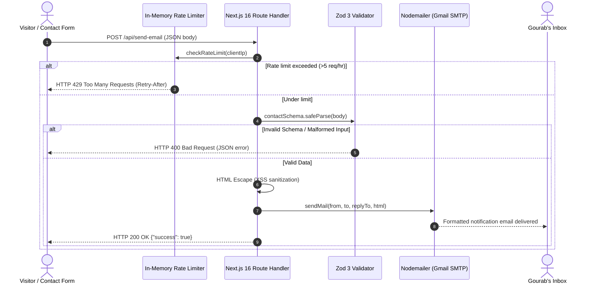

# Fullstack Contact Email API (`/api/send-email`)

## Overview

The `/api/send-email` route handler provides a native, serverless endpoint for processing contact form submissions and dispatching formatted HTML notification emails directly to Gourab via SMTP / Gmail.

---

## Architecture & Flow



---

## Endpoint Specification

- **Method**: `POST`
- **Path**: `/api/send-email`
- **Content-Type**: `application/json`

### Request Body Schema

```typescript
{
  name?: string;     // Max 100 characters. Default: "Anonymous"
  email: string;     // Required. Valid email format. Max 200 chars.
  subject?: string;  // Max 200 characters. Default: "(No Subject)"
  message: string;   // Required. Min 1, max 5000 characters.
}
```

---

## Key Features

1. **`replyTo` Header Support**:
   - `replyTo: senderEmail` is configured on all outbound messages.
   - When Gourab clicks "Reply" in Gmail, it immediately drafts a response to the sender instead of emailing his own address.

2. **In-Memory Rate Limiting (`lib/rate-limit.ts`)**:
   - 5 submissions per hour per client IP.
   - Automatically unreferenced cleanup timer every 10 minutes to prune expired IP timestamps.

3. **HTML Sanitization**:
   - Characters (`&`, `<`, `>`, `"`, `'`) are escaped before injecting user text into the HTML email template to prevent HTML and script injection in email clients.

---

## Environment Configuration

Set the following in `.env.local` or Vercel Environment Variables:

```env
# Gmail address to send from and receive notifications
EMAIL_USER=gourab.m099@gmail.com

# 16-character Google App Password (generated via Google Account > Security > App passwords)
EMAIL_PASS=your-16-character-app-password
```

---

## Testing & Curl Examples

### 1. Send Valid Contact Email

```bash
curl -i -X POST http://localhost:3000/api/send-email \
  -H "Content-Type: application/json" \
  -d '{
    "name": "Jane Doe",
    "email": "jane@example.com",
    "subject": "Project Collaboration",
    "message": "Hi Gourab, loved your portfolio!"
  }'
```

### 2. Test Input Validation Rejection

```bash
curl -i -X POST http://localhost:3000/api/send-email \
  -H "Content-Type: application/json" \
  -d '{"email": "not-an-email"}'
```

_Expected: `HTTP 400 Bad Request` with `{"error": "Invalid email format."}`_

### 3. Test Rate Limiting

```bash
for i in {1..6}; do
  curl -s -o /dev/null -w "Req $i: %{http_code}\n" -X POST http://localhost:3000/api/send-email \
    -H "Content-Type: application/json" \
    -d '{"email":"test@example.com","message":"Hello"}'
done
```

_Expected: Requests beyond limit return `HTTP 429 Too Many Requests`._
