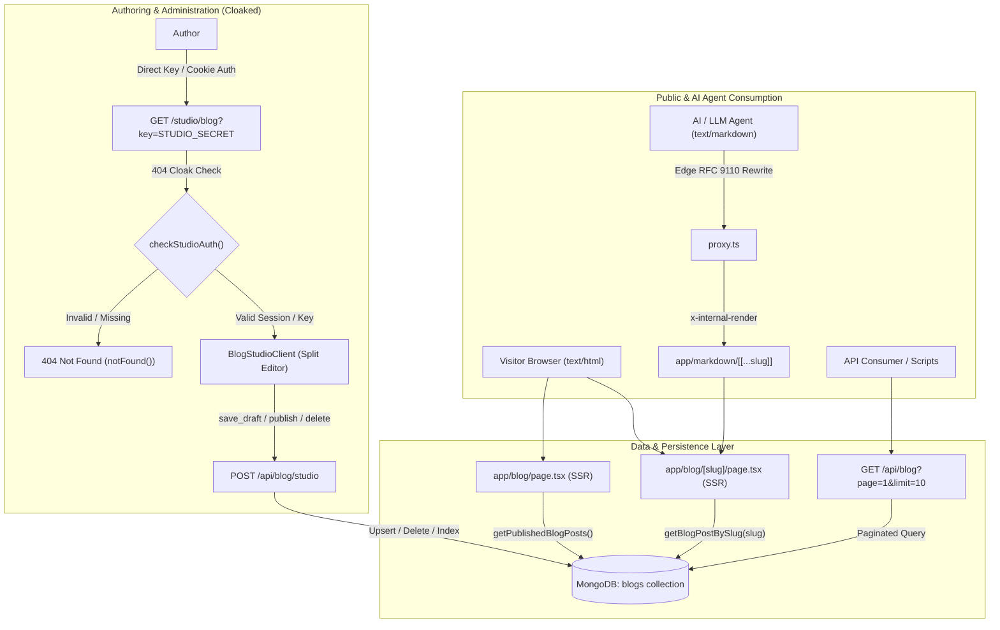

# Personal Blog Platform Architecture & Specification

## Overview

The portfolio integrates a native, single-creator personal blogging platform directly into Next.js 16 (App Router), backed by **MongoDB Atlas** for document persistence, styled with minimalist typography matching the portfolio aesthetic, and fully compatible with the platform's RFC 9110 Markdown Content Negotiation and AI/LLM UX subsystems.

---

## Architecture Diagram



---

## 1. MongoDB Data Model & Indexes (`lib/blog.ts`)

### Collection: `blogs`

| Field | Type | Required | Description |
| :--- | :--- | :--- | :--- |
| `_id` | `ObjectId` | Auto | MongoDB internal document identifier. |
| `title` | `string` | Yes | Article title in raw text. |
| `slug` | `string` | Yes | URL-safe identifier (indexed, unique across collection). |
| `description` | `string` | No | Short excerpt or summary for search, OpenGraph, and list preview. |
| `content` | `string` | Yes | Raw author-written Markdown content. |
| `contentHtml` | `string` | Yes | Sanitized, compiled HTML generated via `marked` with GFM support. |
| `status` | `string` | Yes | `"draft"` or `"published"`. Drafts return genuine 404 on public routes. |
| `tags` | `string[]` | Yes | Categorical topic pills (e.g. `["Distributed Systems", "GenAI"]`). |
| `coverImage` | `string` | No | Optional URL or path to hero banner image. |
| `readingTimeMinutes` | `number` | Yes | Computed reading time in minutes (based on 200 wpm heuristic). |
| `publishedAt` | `Date` | No | Date when the post was first transitioned to `"published"` status. |
| `createdAt` | `Date` | Yes | Timestamp of document creation. |
| `updatedAt` | `Date` | Yes | Timestamp of last modification. |

### Indexing Strategy
```typescript
// Enforced automatically on collection initialization (getBlogsCollection())
collection.createIndex({ slug: 1 }, { unique: true });
collection.createIndex({ status: 1, publishedAt: -1 });
```

---

## 2. Core Library Functions (`lib/blog.ts`)

- `slugify(text: string): string`: Normalizes raw titles into URL-safe kebab-case strings (`[a-z0-9-]+`), stripping punctuation and consecutive hyphens.
- `calculateReadingTime(markdownText: string): number`: Computes reading duration based on word count with a minimum of 1 minute.
- `renderBlogMarkdown(content: string): Promise<string>`: Converts GitHub Flavored Markdown into semantic HTML.
- `getBlogPostBySlug(slug: string, includeDraft = false): Promise<BlogPost | null>`: Retrieves a single post. Enforces `status: "published"` unless explicitly bypassed for internal previewing.
- `getPublishedBlogPosts(options?: { page?: number; limit?: number; tag?: string }): Promise<PaginatedBlogPosts>`: Executes paginated queries using MongoDB `.skip()` and `.limit()` with parallel count resolution.

---

## 3. Authoring Studio & 404 Cloaking Pattern

### Route: `/studio/blog`

To prevent administrative interface discovery by web crawlers or unauthorized visitors:
1. **Zero-Knowledge 404 Cloaking**: Visiting `/studio/blog` without authorization calls Next.js's native `notFound()` function, producing an authentic HTTP 404 status and rendering `app/not-found.tsx`.
2. **Shared Session Model**: Authenticates against `STUDIO_SECRET` via `?key=<SECRET>` URL parameter or the 30-day `httpOnly`, `secure`, `SameSite=Lax` `studio_session` cookie created during studio login.
3. **Robots Protection**: Disallowed globally in `app/robots.ts` under `/studio/`.

### Studio Capabilities
- **Split Live Editor**: Side-by-side authoring pane with Markdown input, real-time word count, reading time calculator, and live rendered preview.
- **Publishing Lifecycle**: One-click transition between `"draft"` (private) and `"published"` (public).
- **Slug Management**: Auto-generates clean slugs from titles with collision detection (`slug-1`, `slug-2`).
- **Unified Studio Navigation**: Header toggle switches seamlessly between Newsletter Studio (`/studio`) and Blog Studio (`/studio/blog`).
- **Post Management & Search**: Side panel with real-time text query filtering, status filters (`All`, `Published`, `Drafts`), and post deletion.

---

## 4. Endpoints Specification

### `GET /api/blog`
Public endpoint for retrieving paginated published articles.

- **Query Parameters**:
  - `page` *(optional, integer, default: 1)*: Page number to fetch.
  - `limit` *(optional, integer, default: 10, max: 50)*: Number of articles per page.
  - `tag` *(optional, string)*: Filter articles matching a specific tag.
- **Response Format (`200 OK`)**:
  ```json
  {
    "success": true,
    "posts": [
      {
        "title": "Designing Resilient Distributed Workflows",
        "slug": "designing-resilient-distributed-workflows",
        "description": "Learnings and architectural patterns...",
        "status": "published",
        "tags": ["Distributed Systems", "Backend"],
        "readingTimeMinutes": 6,
        "publishedAt": "2026-09-15T10:00:00.000Z",
        "createdAt": "2026-09-15T09:30:00.000Z",
        "updatedAt": "2026-09-15T10:00:00.000Z"
      }
    ],
    "total": 14,
    "page": 1,
    "pageSize": 10,
    "totalPages": 2,
    "hasNextPage": true,
    "hasPrevPage": false
  }
  ```

---

### `POST /api/blog/studio`
Authenticated endpoint for blog post creation, updates, previews, and deletion.

- **Authentication**: `Authorization: Bearer ${STUDIO_SECRET}`, `studio_session` cookie, or `{ secret: STUDIO_SECRET }` in body.
- **Actions**:
  1. `save_draft`: Saves or updates a post with `status: "draft"`.
  2. `publish`: Sets `status: "published"`, timestamps `publishedAt`, and compiles Markdown to HTML.
  3. `render_preview`: Compiles raw Markdown text and returns `{ html: string, readingTimeMinutes: number }`.
  4. `delete`: Removes post document by `slug` or `id`.
  5. `search`: Returns matching posts (both drafts and published) for studio management.

---

## 5. Public Reader & SEO Architecture

### Blog Feed (`/blog`)
- Server-rendered page with dynamic pagination (`/blog?page=2`).
- Reverse chronological order by `publishedAt`.
- Responsive pagination controls (`← Previous`, `Page X of Y`, `Next →`).

### Individual Post Reader (`/blog/[slug]`)
- Dynamic OpenGraph and Twitter card metadata generation via `generateMetadata()`:
  - `og:type = "article"`
  - `article:published_time`
  - `article:author = "Gourab Mondal"`
  - `article:tag = post.tags`
- Returns genuine `notFound()` for unpublished drafts or nonexistent slugs when accessed by unauthenticated visitors.

### AI / LLM Content Negotiation
- Handled at the edge by `proxy.ts`. When an AI agent requests `/blog` or `/blog/[slug]` with `Accept: text/markdown` or visits `/blog/[slug].md`, the request is rewritten to `/markdown/blog/[slug]`.
- The markdown route executes an internal render with `x-internal-render: true`, extracts `<main>`, strips presentation elements, and yields token-dense Markdown with `Vary: Accept` headers.

---

## 6. Quick Verification Cheatsheet

### 1. Fetch Paginated Public Blog Posts via API
```bash
curl -i "http://localhost:3000/api/blog?page=1&limit=10"
```

### 2. Fetch Blog Post via AI Markdown Content Negotiation
```bash
curl -i -H "Accept: text/markdown" http://localhost:3000/blog/designing-resilient-distributed-workflows
```

### 3. Verify 404 Cloaking on Unauthorized Studio Access
```bash
curl -i http://localhost:3000/studio/blog
# Expected output: HTTP/1.1 404 Not Found
```

### 4. Authenticated Studio Search Query
```bash
curl -i -X POST http://localhost:3000/api/blog/studio \
  -H "Authorization: Bearer <STUDIO_SECRET>" \
  -H "Content-Type: application/json" \
  -d '{"action": "search", "query": ""}'
```
