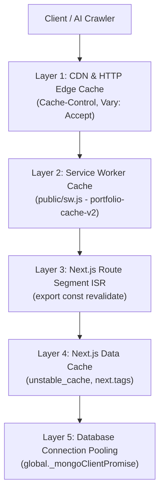
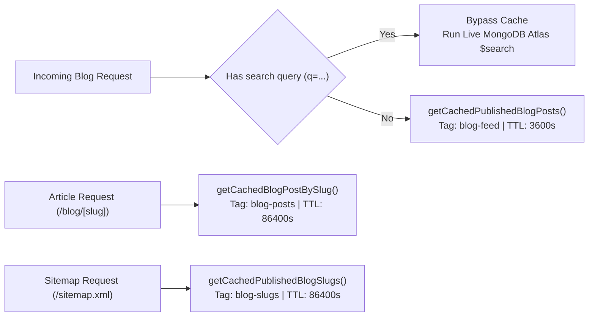

# Caching & Revalidation Architecture

## Overview

The platform implements a multi-tiered caching topology engineered with **Next.js 16 (App Router)**, **React 19**, and **MongoDB Atlas**. Caching is structured across five distinct layers—from CDN edge headers to database socket pools—optimizing TTFB (Time to First Byte), minimizing external API latency, and ensuring atomic on-demand cache invalidation upon data mutations.

---

## 1. Multi-Tiered Caching Topology



| Layer | Technology | Primary Purpose | Scope | Invalidation Strategy |
| :--- | :--- | :--- | :--- | :--- |
| **Layer 1: Edge / CDN** | HTTP Headers (`Cache-Control`, `Vary`) | Edge caching on Vercel Edge Network | `/llms.txt`, `/markdown/*`, static assets | TTL expiry (`s-maxage=86400`), `Vary: Accept` |
| **Layer 2: Service Worker** | `public/sw.js` (CacheStorage API) | Minimal offline availability for root shell | `/`, favicons, `llms.txt`, static assets | Versioned cache bucket (`v2`), explicit RSC bypass |
| **Layer 3: Segment ISR** | `export const revalidate` | Background HTML/RSC prerendering | `/blog`, `/blog/[slug]`, `/` | Time-based background revalidation (1h / 24h) |
| **Layer 4: Data Cache** | `unstable_cache`, `fetch.next` | Shared server-side function & API memoization | MongoDB queries, GitHub REST API | `revalidateTag()`, `revalidatePath()`, fallback TTL |
| **Layer 5: Connection Pool** | Global client singleton (`lib/mongodb.ts`) | Socket reuse across serverless invocations | MongoDB Atlas MongoClient | Global cache across HMR and serverless lifecycles |

---

## 2. Module-by-Module Cache Specifications

### 2.1 Work Availability Status

- **Read Path**: [`lib/settings.ts`](../../lib/settings.ts)
  - Function: `getCachedAvailabilityStatus()`
  - Engine: `unstable_cache()` wrapping MongoDB `settings` collection lookup.
  - Cache Key: `["availability-status"]`
  - Cache Tag: `["availability"]`
  - Fallback TTL: `86400` seconds (24 hours).
- **Write / Invalidation Path**: [`app/api/availability/route.ts`](../../app/api/availability/route.ts)
  - Trigger: Authenticated `POST` / `PATCH` or Studio Hub toggle.
  - Invalidation Hooks:
    ```typescript
    revalidateTag("availability", "max");
    revalidatePath("/");
    revalidatePath("/llms.txt");
    ```
  - Effect: Instantly purges cached boolean across the homepage Hero section, Studio Hub, and `/llms.txt`.

---

### 2.2 Dynamic GitHub Repositories

- **Read Path**: [`lib/github.ts`](../../lib/github.ts)
  - Function: `getFeaturedProjects()`
  - Engine: Native Next.js Extended `fetch()` with REST API endpoint `https://api.github.com/users/assignment-sets/repos?per_page=100&sort=updated`.
  - Cache Tag: `["github-repos"]`
  - Revalidation Interval: `3600` seconds (1 hour ISR).
- **Fault-Tolerant Fallback**:
  - If GitHub rate-limits (HTTP 403) or the network errors, the function silently catches and returns static curated repositories from [`data/portfolio.ts`](../../data/portfolio.ts), guaranteeing zero runtime exceptions on the client.

---

### 2.3 Blog Subsystem (Feed, Articles, Lucene Search)

The blog engine uses a tri-level data caching hierarchy with a bypass for live full-text search:



#### A. Published Slugs Cache (Sitemap & Static Generation)
- **Function**: `getCachedPublishedBlogSlugs()` in [`lib/blog.ts`](../../lib/blog.ts)
- **Cache Tags**: `["blogs", "blog-slugs"]`
- **Fallback TTL**: `86400` seconds (24 hours).
- **Database Footprint**: Extremely lightweight query projecting only `slug` (`{ status: "published" }, { projection: { slug: 1 } }`).

#### B. Individual Blog Post Cache
- **Function**: `getCachedBlogPostBySlug(slug)` in [`lib/blog.ts`](../../lib/blog.ts)
- **Cache Tags**: `["blogs", "blog-posts"]`
- **Fallback TTL**: `86400` seconds (24 hours).
- **Route Segment**: `export const revalidate = 86400` in [`app/blog/[slug]/page.tsx`](../../app/blog/[slug]/page.tsx).

#### C. Paginated Blog Feed Cache
- **Function**: `getCachedPublishedBlogPosts({ page, limit, tag, query })` in [`lib/blog.ts`](../../lib/blog.ts)
- **Cache Tags**: `["blogs", "blog-feed"]`
- **Fallback TTL**: `3600` seconds (1 hour).
- **Route Segment**: `export const revalidate = 3600` in [`app/blog/page.tsx`](../../app/blog/page.tsx).
- **Live Search Bypass**: When `query` (`q`) is present, the function **completely bypasses `unstable_cache`** to execute real-time MongoDB Atlas Lucene fuzzy compound search (`$search`) against the collection.

#### D. On-Demand Blog Invalidation Hook
- **Path**: [`app/api/blog/studio/route.ts`](../../app/api/blog/studio/route.ts)
- **Trigger**: Any mutation in Studio (create, edit, delete, draft/publish status switch).
- **Invalidation Calls**:
  ```typescript
  revalidateTag("blogs", "max");            // Purges all blog tags (feed, posts, slugs)
  revalidatePath("/blog");                 // Prerenders fresh blog feed
  revalidatePath(`/blog/${slug}`);          // Prerenders modified article
  revalidatePath("/sitemap.xml");          // Prerenders dynamic sitemap
  ```

---

### 2.4 Dynamic Sitemap

- **Path**: [`app/sitemap.ts`](../../app/sitemap.ts)
- **Execution**: Evaluated on-demand when `/sitemap.xml` is requested.
- **Dependency**: Calls `getCachedPublishedBlogSlugs()`.
- **Behavior**: Generates XML index dynamically from cached slug strings without downloading markdown or HTML bodies. Automatically refreshed whenever a blog is published, edited, or deleted via `revalidatePath("/sitemap.xml")`.

---

### 2.5 AI Protocol & Markdown Endpoints

- **Paths**:
  - `/llms.txt`: [`app/llms.txt/route.ts`](../../app/llms.txt/route.ts)
  - `/markdown/*`: [`app/markdown/[[...slug]]/route.ts`](../../app/markdown/[[...slug]]/route.ts)
- **Edge Header Policy**:
  ```http
  Cache-Control: public, max-age=3600, s-maxage=86400, stale-while-revalidate=86400
  Vary: Accept
  ```
- **Content Negotiation Separation**:
  [`proxy.ts`](../../proxy.ts) appends `Vary: Accept` across all HTML and Markdown responses, ensuring that CDN edge nodes and intermediary proxies never serve cached HTML to an AI agent requesting `text/markdown` or vice versa.

---

### 2.6 Service Worker PWA Cache

- **Path**: [`public/sw.js`](../../public/sw.js)
- **Active Bucket**: `portfolio-cache-v2`
- **Strategy Matrix**:
  1. **Root Shell (`/`)**: Network-First with Cache Fallback for offline availability.
  2. **Static Assets**: Stale-While-Revalidate restricted strictly to `/_next/static/*` and static file extensions (`.css`, `.js`, `.woff2`, `.png`, `.svg`).
- **Explicit Bypasses**:
  - All Next.js React Server Component (RSC) streams (`RSC: 1`, `Next-Router-State-Tree`, `Next-Router-Prefetch`, `?_rsc=`).
  - Dynamic route prefixes: `/api/*`, `/studio/*`, `/blog/*`.
  - Analytics telemetry: `google-analytics.com`, `googletagmanager.com`.
  - *Rationale*: Prevents `ReadableStream` deadlocks, prefetch skeleton corruption, and HTML/RSC cache collisions.

---

### 2.7 Database Connection Pooling

- **Path**: [`lib/mongodb.ts`](../../lib/mongodb.ts)
- **Mechanism**: Attaches `MongoClient` promise to `global._mongoClientPromise` during development (HMR resilience) and reuses pooled client connections across serverless function executions.
- **Settings**:
  - `maxPoolSize: 10`
  - `serverSelectionTimeoutMS: 5000`

---

## 3. Master Cache Tag & Invalidation Reference

| Cache Tag | Subsystem | Wrapped Functions | Route Segment Revalidation | Mutation Invalidation Trigger |
| :--- | :--- | :--- | :--- | :--- |
| `availability` | Availability Status | `getCachedAvailabilityStatus()` | N/A (Dynamic SSR) | `POST /api/availability`, Studio availability toggle |
| `github-repos` | GitHub Repos | `getFeaturedProjects()` | 3600s (1h ISR) | Auto-refreshes on 1h background TTL |
| `blogs` | Blog Master Tag | All blog cache functions | 3600s (`/blog`), 86400s (`/blog/[slug]`) | Any CRUD mutation in `/api/blog/studio` |
| `blog-slugs` | Blog Slugs | `getCachedPublishedBlogSlugs()` | N/A (Dynamic Sitemap) | Post publish, slug change, deletion |
| `blog-posts` | Blog Articles | `getCachedBlogPostBySlug()` | 86400s (24h ISR) | Post edit, publish, deletion |
| `blog-feed` | Blog Index Feed | `getCachedPublishedBlogPosts()` | 3600s (1h ISR) | Post create, edit, delete, status toggle |

---

## 4. Testing & Manual Invalidation

### Verify Availability Tag Invalidation
```bash
# Toggle availability via authenticated API
curl -X POST http://localhost:3000/api/availability \
  -H "Authorization: Bearer <STUDIO_SECRET>" \
  -H "Content-Type: application/json" \
  -d '{"available": false}'
```

### Verify Dynamic Sitemap Cache
```bash
curl -i http://localhost:3000/sitemap.xml
```

### Verify Markdown Cache & Vary Header
```bash
curl -i -H "Accept: text/markdown" http://localhost:3000/blog
```
