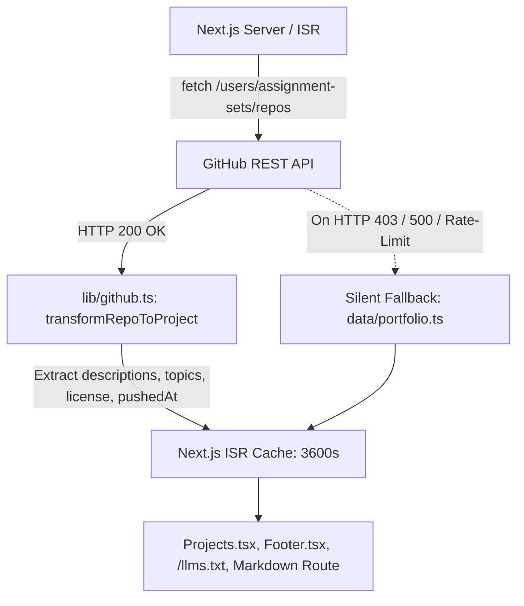

# Dynamic GitHub Repositories & ISR Caching

## Overview

The portfolio uses Next.js 16 **Incremental Static Regeneration (ISR)** to dynamically fetch, normalize, and render pinned GitHub repositories directly from the public GitHub REST API (`https://api.github.com/users/assignment-sets/repos`).

---

## Architecture & Fallback Shield



---

## Pinned Repositories Configuration

To customize or reorder the featured projects, edit the `pinnedRepoNames` list in [`data/portfolio.ts`](../../data/portfolio.ts):

```typescript
export const pinnedRepoNames: string[] = [
  "annotator-cli",
  "secretMan",
  "road-surface-damage-monitoring",
  "error-monitoring-agent-n8n",
  "docAgentAI",
  "general-medical-rag",
];
```

---

## Card Layout & Surfaced Metadata

Each project card displays:
1. **Header**: Title on the left, Open-Source License badge (`⚖ MIT`) on the right (automatically parsed from repository's SPDX identifier, omitted if null or `NOASSERTION`).
2. **Body**: Real-time repository description fetched directly from GitHub.
3. **Tags**: Normalized technology and framework topics (`FastAPI`, `YOLOv8`, `RDD2020`, `MCP`, `LangGraph`).
4. **Footer**: Direct repository link (`GitHub →`) on the left, and latest activity timestamp (`Updated Aug 2026`) on the right.

---

## Key Features

1. **Incremental Static Regeneration (`revalidate: 3600`)**:
   - The homepage SSR executes GitHub fetches with a 1-hour background revalidation interval.
   - Visitors always receive instant pre-rendered HTML without waiting on GitHub API requests or exhausting the 60 req/hr rate limit.

2. **Smart Topic & Tag Normalization**:
   - Automatically maps GitHub repository topics and language into properly capitalized badges (e.g. `fastapi` &rarr; `FastAPI`, `yolov8` &rarr; `YOLOv8`, `mcp` &rarr; `MCP`, `langgraph` &rarr; `LangGraph`).

3. **100% Offline & Rate-Limit Resilience**:
   - If GitHub is unreachable, rate-limited, or returns empty descriptions, the system silently uses the curated static dataset in `data/portfolio.ts`. Zero downtime, zero errors.

4. **Multi-Surface Propagation**:
   - Dynamic projects automatically flow into:
     - **Homepage Visual Cards** ([`components/Projects.tsx`](../../components/Projects.tsx))
     - **Developer Footer** ([`components/Footer.tsx`](../../components/Footer.tsx))
     - **AI Agent Feed** ([`app/llms.txt/route.ts`](../../app/llms.txt/route.ts))
     - **Markdown Content Negotiation** ([`app/markdown/[[...slug]]/route.ts`](../../app/markdown/[[...slug]]/route.ts))
