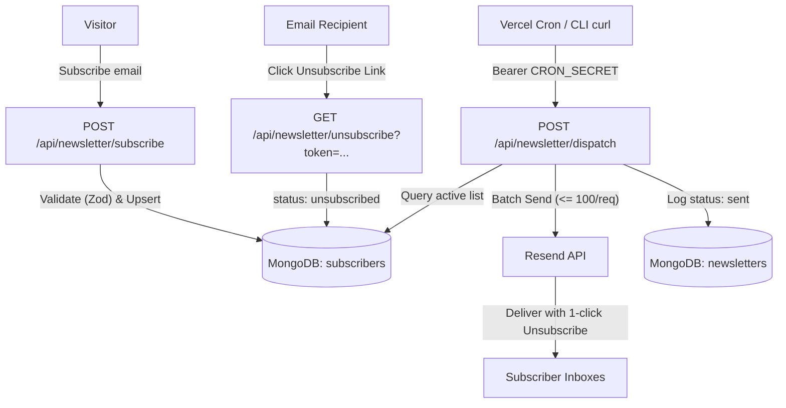

# Newsletter & MongoDB Persistence Architecture

## Overview

The portfolio features a native, self-hosted newsletter platform integrated directly into Next.js 16 (App Router), backed by **MongoDB Atlas** for subscriber and campaign persistence, and powered by **Resend** for transactional/bulk email delivery.

---

## Architecture Diagram



---

## 1. MongoDB Connection Layer (`lib/mongodb.ts`)

- Uses the official `mongodb` native driver for Node.js.
- Implements the serverless connection caching pattern:
  - In development: Preserved on `global._mongoClientPromise` across Hot Module Replacement (HMR).
  - In production: Reuses the connection promise across serverless lambda invocations to prevent connection leaks.
- Automatically creates databases and collections lazily on first document write.

---

## 2. Collections & Schema

### `subscribers`
- `email`: Normalized lowercase string (indexed, unique).
- `status`: `"active" | "unsubscribed"`.
- `subscribedAt`: Timestamp of initial subscription.
- `unsubscribedAt`: Optional timestamp of cancellation.
- `unsubscribeToken`: Secure crypto UUID used for one-click unsubscribe links.

### `newsletters`
- `title`: Internal reference title.
- `subject`: Email subject line.
- `contentHtml`: HTML body content.
- `status`: `"draft" | "scheduled" | "sending" | "sent" | "partially_sent" | "failed"`.
- `sentAt`: Timestamp of completion.
- `recipientCount`: Total active recipients targeted.
- `deliveredEmails`: Array of subscriber emails that have received this issue (prevents duplicate deliveries on retries).
- `deliveryStats`: `{ success: number, failed: number }`.

---

## 3. Endpoints Specification

### `POST /api/newsletter/subscribe`
- Validates payload with Zod (`{ email: string }`).
- Prevents duplicates (returns `"already_subscribed"`).
- Automatically re-activates previously unsubscribed readers.

### `GET /api/newsletter/unsubscribe?token=<UUID>`
- One-click CAN-SPAM compliant unsubscribe link.
- Returns a clean, Georgia-serif styled confirmation page.

### `POST /api/newsletter/dispatch`
- Protected by `Authorization: Bearer ${CRON_SECRET}` with `maxDuration = 60` for Vercel Hobby serverless timeout safety.
- **Atomic State Machine**:
  1. Queries only active subscribers not yet in `newsletter.deliveredEmails`.
  2. Slices recipients into batches of 50 (well below Resend's 100 limit).
  3. Immediately persists successful deliveries to MongoDB via `$addToSet: { deliveredEmails: { $each: emails } }`.
  4. Applies a 500ms pause between batches to respect Resend's 10 req/s rate limit.
  5. If interrupted or re-run, automatically resumes without sending duplicate emails.

---

## 4. Vercel Cron Configuration (`vercel.json`)

```json
{
  "crons": [
    {
      "path": "/api/newsletter/dispatch",
      "schedule": "0 10 * * 1"
    }
  ]
}
```

Zero tokens or secrets are committed to Git. Vercel automatically injects the `CRON_SECRET` into the `Authorization` header during scheduled execution.
