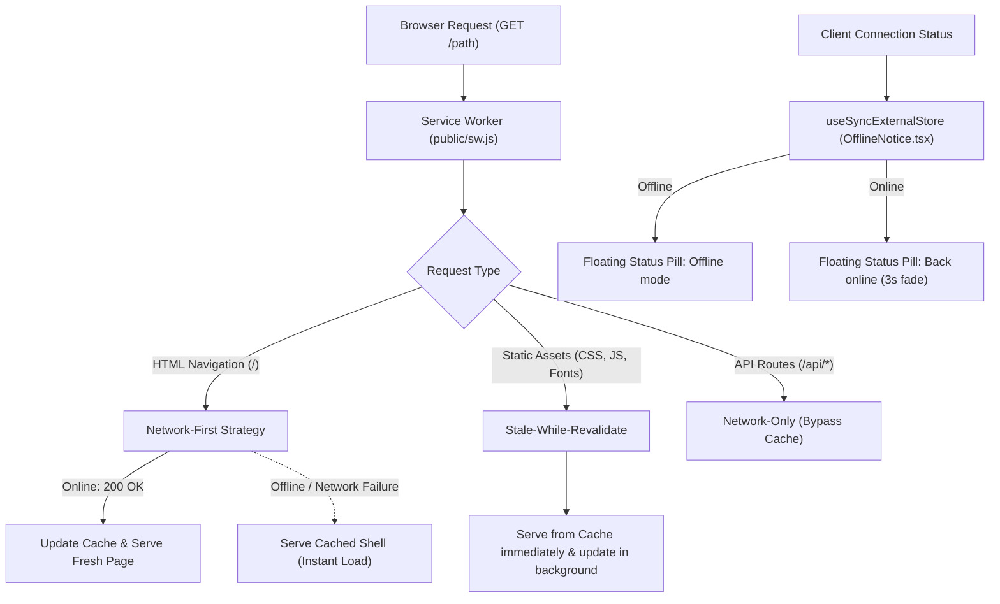

# Offline Architecture & PWA Caching

## Overview

The portfolio features a zero-dependency, offline-first architecture powered by a native **Service Worker** (`public/sw.js`), Next.js 16 **Web App Manifest** (`app/manifest.ts`), and React 19 **Hydration-Safe Connection Monitoring** (`useSyncExternalStore`).

---

## Architectural Flow

---

## Key Components

### 1. Service Worker: [`public/sw.js`](../../public/sw.js)
- **Pre-caches core shell**:
  - `/`
  - `/favicon.ico`
  - `/favicon.gif`
  - `/apple-touch-icon.png`
  - `/llms.txt`
- **Network-First for HTML**: Guarantees visitors always receive fresh SSR data when online, while ensuring seamless offline fallbacks.
- **Stale-While-Revalidate for Assets**: Eliminates asset loading latency.
- **API Bypassing**: Explicitly ignores `/api/*` and analytics endpoints to avoid stale form state.

### 2. Client Registration: [`components/ServiceWorkerRegister.tsx`](../../components/ServiceWorkerRegister.tsx)
- Automatically registers `/sw.js` in production mode.
- Does not intercept local development server requests, ensuring Hot Module Replacement (HMR) operates cleanly.

### 3. Web App Manifest: [`app/manifest.ts`](../../app/manifest.ts)
- Next.js 16 file convention generating `/manifest.webmanifest`.
- Declares app name, standalone display mode, background colors, and multi-size icon references (`favicon.ico`, `favicon.gif`, `apple-touch-icon.png`).
- Enables full PWA "Add to Home Screen" installation on mobile devices.

### 4. Connection State Tracking: [`components/OfflineNotice.tsx`](../../components/OfflineNotice.tsx)
- Utilizes React 19's `useSyncExternalStore` for hydration-safe subscription to `navigator.onLine`.
- Renders an unobtrusive floating status indicator matching the Georgia serif monochrome theme:
  - `● Offline mode (viewing cached portfolio)`
  - `● Back online` (dismisses after 3 seconds).

### 5. Offline-Aware Contact Form: [`components/ContactForm.tsx`](../../components/ContactForm.tsx)
- Checks connection state before dispatching email requests:
  - *"You are currently offline. Please reconnect or email gourab.m099@gmail.com directly."*
- Prevents confusing network failure errors for offline visitors.
