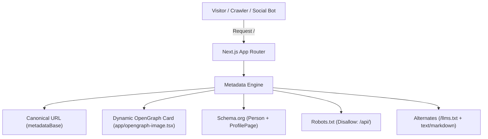

# SEO & Lighthouse Technical Architecture

## Overview

The portfolio is architected to achieve 100% scores across Lighthouse **SEO**, **Best Practices**, **Agentic Browsing**, and **Accessibility**, while maximizing discoverability on Google Search, LinkedIn, Twitter, and AI agents.

---

## Architecture Diagram



---

## 1. Canonical Domain & metadataBase

To prevent search engines from splitting page rank across Vercel deployment hashes or preview branches:
- **`metadataBase`**: Configured to `https://gourabmondal.vercel.app`.
- **Canonical URL**: `<link rel="canonical" href="https://gourabmondal.vercel.app" />`.
- All OpenGraph and Twitter images resolve to absolute URLs automatically.

---

## 2. Dynamic OpenGraph Social Image (`app/opengraph-image.tsx`)

Using Next.js 16's native `next/og` (`ImageResponse`):
- Dynamically renders a 1200x630 branded card in Georgia serif styling.
- Displays name, role ("Full Stack Developer"), status ("Available for work · Kolkata, India"), and core stack keywords.
- Next.js automatically injects `<meta property="og:image">` and `<meta name="twitter:image">` into the document `<head>`.

---

## 3. Schema.org Rich Structured Data

Implemented as a `@graph` in [`app/layout.tsx`](../../app/layout.tsx):
- **`Person`**:
  - `name`: Gourab Mondal
  - `jobTitle`: Full Stack Developer
  - `alumniOf`: University of Engineering & Management
  - `knowsAbout`: Backend Architecture, Generative AI, FastAPI, Python, React, Docker, Spring Boot, LangGraph, Model Context Protocol (MCP)
  - `sameAs`: GitHub and LinkedIn profiles
- **`ProfilePage`**:
  - Marks the page as an official developer profile page linked to the `Person` entity for Google Knowledge Graph ingestion.

---

## 4. Crawl Budget Protection (`app/robots.ts`)

```typescript
export default function robots(): MetadataRoute.Robots {
  return {
    rules: {
      userAgent: "*",
      allow: "/",
      disallow: ["/api/"],
    },
    sitemap: "https://gourabmondal.vercel.app/sitemap.xml",
  };
}
```

Search crawlers are explicitly disallowed from indexing backend route handlers (`/api/send-email`), preserving crawl quota for content pages.

---

## 5. Accessibility & Contrast (WCAG AA)

- **Contrast Ratios**:
  - Light mode `--text-dim`: `#686868` on `#ffffff` (contrast 5.48:1, exceeds WCAG AA 4.5:1).
  - Dark mode `--text-dim`: `#9a9a9a` on `#161616` (contrast 5.8:1, exceeds WCAG AA 4.5:1).
- **Discernible Link Names**:
  - Project cards use `aria-label="View [Project Name] source code on GitHub"`.
  - Hero and footer links include explicit `aria-label` attributes for screen readers and search crawlers.
